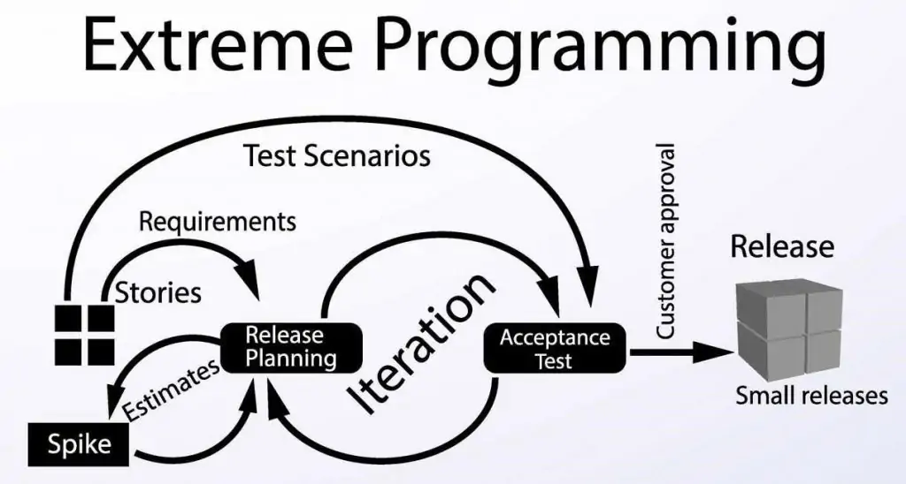
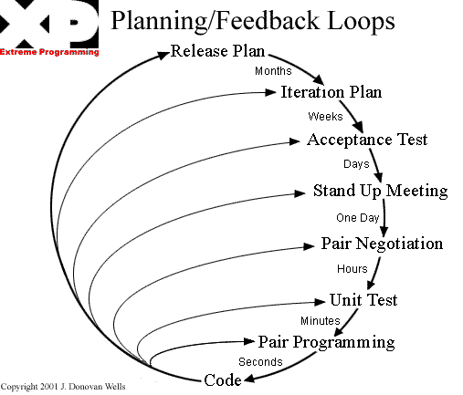

# Visão do produto e do projeto

## Histórico de Revisão

| Data  | Versão | Descrição                                            | Autor                                |
| :---: | :----: | :--------------------------------------------------- | :----------------------------------- |
| 15/11 |  1.0   | Criação do documento                                 | João, Eduardo, Paulo, Milena, Ian    |
| 21/11 |  1.1   | Refinando documento de acordo com o feedback passado | João, Eduardo, Milena, Ian, Lizandra |

## 1 Visão geral do produto

### 1.1 Declaração de Posição do Produto

|          Para | Escola Aliança Francesa                                                                                       |
| ------------: | :------------------------------------------------------------------------------------------------------------ |
|          Quem | Realiza o cadastro de alunos,gerencia turmas,consulta o historico do aluno e verifica a situação de pagamento |
|       O Sigma | E uma plataforma para cadastro e gestão de alunos,professores,turmas e notas                                  |
|           Que | Realiza matricula de forma online sem que o cliente precise se deslocar a secretaria da escola                |
|  Ao contrário | Da plataforma que só pode ser utilizada pelos funcionarios                                                    |
| Nosso produto | Agiliza processos burocraticos e facilita a integração entre aluno e escola atraves de um sistema digital     |

### 1.2 Objetivos do Produto

Servir como um sistema de gestão onde seja feito o cadastro de alunos, professores e turmas. Ainda, o aluno poderá fazer sua própria matrícula de forma que contabiliza no sistema automaticamente. O professor poderá lançar notas, e o histórico do aluno ficará guardado no sistema. Assim, poderá ser feito um acompanhamento das notas do aluno, os horários e disponibilidades das turmas, também ficarão disponíveis dados como situação financeira e dados do professor, como as turmas que são ministradas por ele.

### 1.3 Tecnologias a Serem Utilizadas

- ReactJS
- Java Spring Boot
- MySQL
- Docker
- AWS

## 2 Visão geral do projeto

Será utilizado como base o framework de trabalho XP(Extreme Programing)

### 2.1 Organização do Projeto

| Papel      | Atribuições                                                              | Responsável             | Participantes           |
| ---------- | ------------------------------------------------------------------------ | ----------------------- | ----------------------- |
| Manager    | Responsavel pelo planning game                                           | João Pedro Anacleto     | João Pedro Anacleto     |
| Coach      | Ajudar os desenvolvedores e garantir o uso das práticas do XP            | Eduardo Rodrigues       | Eduardo Rodrigues       |
| Developers | Codificação do produto e dos testes                                      | Ian da Costa Gama       | Milena,Ian,Lizandra     |
| Customer   | Acompanhar a equipe durante o desenvolvimento afim de garantir o produto | Escola Aliança Francesa | Escola Aliança Francesa |

### 2.2 Planejamento das Fases e/ou Iterações do Projeto

| Iteração    | Entrega                                                | Data Início | Data Fim |
| :---------- | :----------------------------------------------------- | :---------: | :------: |
| Iteração 0  | Visão do Produto e do projeto                          |    15/11    |  18/11   |
| Iteração 1  | Levantamento de Estórias, Planning Game e Arquitetura. |    21/11    |  25/11   |
| Iteração 2  | Implementação do release 1                             |    28/11    |  02/12   |
| Iteração 3  | Implementação do release 1                             |    05/12    |  09/12   |
| Iteração 4  | Implementação e entrega da Release 1                   |    12/12    |  16/12   |
| Iteração 5  | Implementação do release 2                             |    19/12    |  23/12   |
| Iteração 6  | Implementação do release 2                             |    02/01    |  06/01   |
| Iteração 7  | Implementação e entrega da Release 2                   |    09/01    |  13/01   |
| Iteração 8  | Implementação da release 3                             |    16/01    |  20/01   |
| Iteração 9  | Implementação da release 3                             |    23/01    |  27/01   |
| Iteração 10 | Release 3                                              |    30/01    |  03/02   |

### 2.3 Matriz de Comunicação

| Descrição                | Área/Envolvidos                                          | Periodicidade               | Produtos Gerados                                  |
| ------------------------ | -------------------------------------------------------- | --------------------------- | ------------------------------------------------- |
| Reunião de alinhamento   | Equipe do Projeto                                        | quarta e sexta (assíncrona) | Acompanhar andamento do projeto                   |
| Planejamento de Iteração | Equipe do Projeto (obrigatório para o Manager e o coach) | segunda                     | Atividades a serem feitas na Iteração             |
| Planning game            | Equipe e cliente                                         | A cada release              | As estórias que serão implementadas nessa release |

### 2.4 Gerenciamento de Riscos

Riscos identificados:

- Problemas de comunicação entre os integrantes do grupo.
- Tempo necessário a ser dedicado ao projeto afetado por atividades externas.
- Falhas em gerenciamento ou organização do projeto.
- Problemas na parte de desenvolvimento devido a falta de conhecimento da linguagem escolhida.
- Atraso da iteração devido a má previsão da nossa capacidade produtiva.

 

Soluções a serem tomadas para mitigação dos riscos:

- Informar a equipe horários disponíveis na rotina e melhor organização pessoal.
- Participar das reuniões de alinhamento e estar sempre atento aos grupos de comunicações.
- Entregar atividades realizadas na Iteração sempre no prazo e estar atento ao calendário de entregas.
- Estudar frequentemente para se familiarizar a linguagem escolhida para desenvolvimento projeto.
- Comparar as novas atividades com as passadas e o seu real tempo de implementação para melhorar a previsão de conclusão de uma atividade.

#### 2.4.1 Histórico de Riscos

| Iteração | Risco Encontrado                   |     Nível      |
| :------: | :--------------------------------- | :------------: |
|    0     | Adição de um novo membro na equipe | Negligenciável |
|    1     | Membro da equipe trancou a materia |  Considerável  |

### 2.5 Criterios de Replanejamento

Este topico se refere a como reorganizar o projeto caso ocorra impedimentos durante seu desenvolvimento.

| Problema                     | Risco ao Projeto                     | Replanejamento                                 |
| :--------------------------- | :----------------------------------- | :--------------------------------------------- |
| Trancamento de disciplina    | Falta de desenvolvedores             | Redistribuição de tarefas                      |
| Atraso no desenvolvimento    | Entrega menor de funcionalidades     | Refinamento nos criterios de estimativa        |
| Alteração nos requisitos     | Tempo gasto em novas funcionalidades | Replanejar o cronograma de entregas do projeto |
| Indisponibilidade do cliente | Incapacitação da equipe              | Tentar outros meios de contato com o cliente   |

## 3 Processo de Desenvolvimento de Software

Devido ao prazo curto para o projeto, a volatividade dos requisitos e a disponibilidade do cliente, a equipe escolheu o método XP. Porém, a equipe não terá tempo suficiente de fazer todos os procedimentos, como por exemplo as dailys, então a abordagem está adaptada, com enfoque no pair programming, no TDD e no jogo de planejamento.

### 3.1 Metodologia

Usaremos a maior parte das características do XP no decorrer do projeto, porém, devido a falta de disponibilidade dos membros da equipe, não será possível realizar as stand-up meetings, por isso, a equipe realizará um alinhamento assíncrono duas vezes por semana em um canal de texto no Discord.

### 3.2 Ferramentas

- Notion - para gerenciamento de tarefas, anotações e atas de reunião.
- Figma - para prototipação de telas.
- Discord - para programação em par, reuniões síncronas e assíncronas (Reunião de alinhamento).
- Github - para versionamento de código.

 

- Intelij IDEA - para desenvolvimento da API.
- Visual Studio Code - para desenvolvimento do client front-end.
- Docker - para criação de containers para o banco de dados.

### 3.3 Processos e Procedimentos

De acordo com a abordagem _XP ADAPTADA_, definiu-se:

- Planning de Iteração: realizada toda segunda-feira;
- Reunião de Alinhamento: realizada duas vezes na semana, quarta-feira e sexta-feira;
- Planning game: realizada antes do início de cada release;

 

- Release: como descrito na [tabela de planejamento](#22-planejamento-das-fases-eou-iterações-do-projeto);
- Iteração: duração de 5 dias, de segunda à sexta;
- Estória: Uma funcionalidade pedida pelo cliente e validada por um teste de aceitação
- Atividade: Uma atividade que faz parte de uma estória e deve ser feita por um desenvolvedor
- Pair programming: atividade feita em dupla, onde há um desenvolvedor front-end e um desenvolvedor back-end.
- TDD: nas atividades de back-end, realizar os testes unitários antes das funcionalidade.
- Testes de aceitação: verificar se a interface front-end em conjunto com as funcionalidade do back-end atendem as expectativas do cliente.

### 3.4 Fluxo de trabalho

## 4 Lições Aprendidas

### 4.1 Unidade 1

Aprendemos nesta unidade as várias metodologias e a importância de seguir suas técnicas.A importância do contato com o cliente seja constantemente ou em determinadas fases do desenvolvimento do produto.Juntamente de como se preparar para as possíveis adversidades que podem impactar no desenvolvimento do projeto além dos conteúdos ministrados em aula como os fundamentos,abordagens,ciclos de vida,regras de negócio e etc.

# Apresentação da Visão de produto e projeto

<iframe width="560" height="315" src="https://www.youtube.com/embed/p-VcXGQFFpk" title="YouTube video player" frameborder="0" allow="accelerometer; autoplay; clipboard-write; encrypted-media; gyroscope; picture-in-picture" allowfullscreen></iframe>

