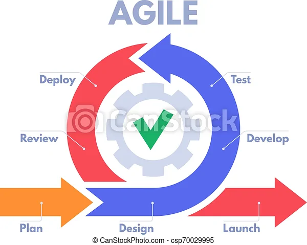

# Visão do produto e do projeto

## Histórico de Revisão

| Data  | Versão | Descrição            | Autor                             |
| :---: | :----: | :------------------- | :-------------------------------- |
| 15/11 |  1.0   | Criação do documento | João, Eduardo, Paulo, Milena, Ian |

## 1 Visão geral do produto

### 1.1 Declaração de Posição do Produto

|          Para | Escola Aliança Francesa                                                                                       |
| ------------: | :------------------------------------------------------------------------------------------------------------ |
|          Quem | Realiza o cadastro de alunos,gerencia turmas,consulta o historico do aluno e verifica a situação de pagamento |
|       O Sigma | E uma plataforma para cadastro e gestão de alunos,professores,turmas e notas                                  |
|           Que | Realiza matricula de forma online sem que o cliente precise se deslocar a secretaria da escola                |
|  Ao contrário | Da plataforma que só pode ser utilizada pelos funcionarios                                                    |
| Nosso produto | Agiliza processos burocraticos e facilita a integração entre aluno e escola atraves de um sistema digital     |

### 1.2 Objetivos do Produto

Servir como um sistem de gestão onde seja feito o cadastro de alunos, professores e turmas. Ainda, o aluno poderá fazer sua própria matrícula de forma que sensibiliza no sistema automaticamente. O professor poderá lançar notas, e o histórico do luno ficará guardado no sistema. Assim, poderá ser feito um acompanhamento das notas do aluno, os horários e disponibilidades das turmas, também ficarão disponíveis dados como situação financeira e dados do professor, como as turmas que são ministradas por ele.

### 1.3 Tecnologias a Serem Utilizadas

- ReactJS
- Java Spring Boot
- MySQL
- Docker
- AWS

## 2 Visão geral do projeto

Será utilizado como base o framework de trabalho Scrum de maneira a ser adaptada ao contexto do projeto uma vez que a equipe não possue disponibilidade diaria para realizar dailys.

### 2.1 Organização do Projeto

| Papel           | Atribuições                                                                                                     | Responsável               | Participantes |
| --------------- | --------------------------------------------------------------------------------------------------------------- | ------------------------- | ------------- |
| Scrum Master    | garantir que sejam realizadas as reuniões e outros rituais do scrum.                                            | João Pedro Anacleto       |               |
| Product Owner   | realizar a manutenção do backlog,assegurar o objetivo do produto e solicitar a implementação de funcionalidades | Eduardo                   |               |
| Desenvolvedores | Codificação do produto e dos testes                                                                             | Paulo,Milena,Ian,Lizandra |               |

### 2.2 Planejamento das Fases e/ou Iterações do Projeto

| Sprint    | Entrega                       | Data Início | Data Fim |
| :-------- | :---------------------------- | :---------: | :------: |
| Sprint 0  | Visão do Produto e do projeto |    15/11    |  18/11   |
| Sprint 1  |                               |    21/11    |  25/11   |
| Sprint 2  |                               |    28/11    |  02/12   |
| Sprint 3  |                               |    05/12    |  09/12   |
| Sprint 4  | Release 1                     |    12/12    |  16/12   |
| Sprint 5  |                               |    19/12    |  23/12   |
| Sprint 6  |                               |    02/01    |  06/01   |
| Sprint 7  | Release 2                     |    09/01    |  13/01   |
| Sprint 8  |                               |    16/01    |  20/01   |
| Sprint 9  |                               |    23/01    |  27/01   |
| Sprint 10 | Release 3                     |    30/01    |  03/02   |

### 2.3 Matriz de Comunicação

| Descrição              | Área/Envolvidos                           | Periodicidade               | Produtos Gerados                               |
| ---------------------- | ----------------------------------------- | --------------------------- | ---------------------------------------------- |
| Reunião de alinhamento | Equipe do Projeto                         | quarta e sexta (assíncrona) | Acompanhar andamento do projeto                |
| Planejamento de Sprint | Equipe do Projeto (obrigatório para o PO) | segunda                     | Atividades a serem feitas na sprint            |
| Entrega de release     | Equipe e cliente, Equipe e professor      | A cada release              | Um software funcional e um feedback do cliente |

### 2.4 Gerenciamento de Riscos

Riscos identificados:

- Problemas de comunicação entre os integrantes do grupo.
- Tempo necessário a ser dedicado ao projeto afetado por atividades externas.
- Falhas em gerenciamento ou organização do projeto.
- Problemas na parte de desenvolvimento devido a falta de conhecimento da linguagem escolhida.

 

Soluções a serem tomadas para mitigação dos riscos:

- Informar a equipe horários disponíveis na rotina e melhor organização pessoal.
- Participar diariamente das reuniões de alinhamento e estar sempre atento aos grupos de comunicações.
- Entregar atividades realizadas na sprint sempre no prazo e estar atento ao calendário de entregas.
- Estudar frequentemente para se familiarizar a linguagem escolhida para desenvolvimento projeto.

#### 2.4.1 Histórico de Riscos

| Sprint | Risco Encontrado                   |     Nível      |
| :----: | :--------------------------------- | :------------: |
|   0    | Adição de um novo membro na equipe | Negligenciável |

### 2.5 Criterios de Replanejamento

Este topico se refere a como reorganizar o projeto caso ocorra impedimentos durante seu desenvolvimento.

| Problema                  | Risco ao Projeto         | Replanejamento            |
| :------------------------ | :----------------------- | :------------------------ |
| Trancamento de disciplina | falta de desenvolvedores | Redistribuição de tarefas |

## 3 Processo de Desenvolvimento de Software

### 3.1 Metodologia

Usaremos a maior parte das características do ScrumXP no decorrer do projeto, porém, devido a falta de disponibilidade dos membros da equipe, não será possível realizar as dailys, por isso, a equipe realizará um alinhamento assíncrono duas vezes por semana em um canal de texto no Discord.

### 3.2 Ferramentas

- Notion - para gerenciamento de tarefas, anotações e atas de reunião.
- Figma - para prototipação de telas.
- Discord - para programação em par, reuniões síncronas e assíncronas (Reunião de alinhamento).
- Github - para versionamento de código.
  - Issues serão criadas para oficializar o cumprimento de cada tarefa, mas não serão utilizadas para gerenciamento de tarefas.

 

- Intelij IDEA - para desenvolvimento da API.
- Visual Studio Code - para desenvolvimento do client front-end.
- Docker - para criação de containers para o banco de dados.

### 3.3 Processos e Procedimentos

De acordo com a abordagem _SCRUM ADAPTADA_, definiu-se:

- Planning: realizada toda segunda-feira;
- Reunião de Alinhamento: realizada duas vezes na semana, quarta-feira e sexta-feira;
- Sprint: duração de 5 dias, de segunda à sexta;
- Release: como descrito na [tabela de planejamento](#22-planejamento-das-fases-eou-iterações-do-projeto);
- Review: realizada antes da reunião de planning;

### 3.4 Fluxo de trabalho

## 4 Lições Aprendidas

### 4.1 Unidade 1

Aprendemos nesta unidade as varias metodologias e a importancia de seguir suas tecnicas.A importancia do contato com o cliente seja constantemente ou em determinadas fases do desenvolvimento do produto.Juntamente de como se preparar para as possiveis adversidades que podem impactar no desenvolvimento do projeto alem dos conteudos ministrados em aula como os fundamentos,abordagens,ciclos de vida,regras de negocio e etc.
